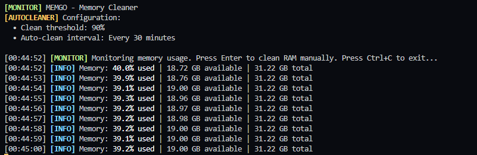

# Memgo - Memory Cleaner in GO

A simple, but effective CLI-only memory cleaner for `Windows`, `Linux` and `macOS` (Darwin). It monitors the physical memory (RAM) usage and can clean the RAM based on configurable thresholds and intervals. Manual cleaning is also supported.

## Requirements:

- `Go 1.16+`

## How to install:
```bash
git clone https://github.com/xurcs/memgo.git
cd memgo
go mod tidy
```

## Config: 

```
[AUTOCLEANER]
CLEAN_ABOVE = 90 ## clean above this percentage of memory usage
CLEAN_INTERVAL = 30 ## clean interval in minutes

[CONFIG]
UPDATE_INTERVAL = 1 ## update interval in seconds
```
Visit the [Config here](Memgo.toml).

## Run:

```
go run src/main.go
```

## Output:



## Alternative:

- [Mem Reduct](https://memreduct.org/) (GUI)

## Potential Bugs:

I only tested out the `Windows` build, but after my research the `macOS` and `Linux` build should work just as fine.

***Notes:** 
- Some memory is reserved or in use by active processes, so it **cannot** be cleaned repeatedly.  


- After the first cleanup, you may see a significant decrease in usage. Further cleanups will only free a small amount, as most remaining memory is required by the system or running applications.

 If you face any bugs, feel free to reach out.